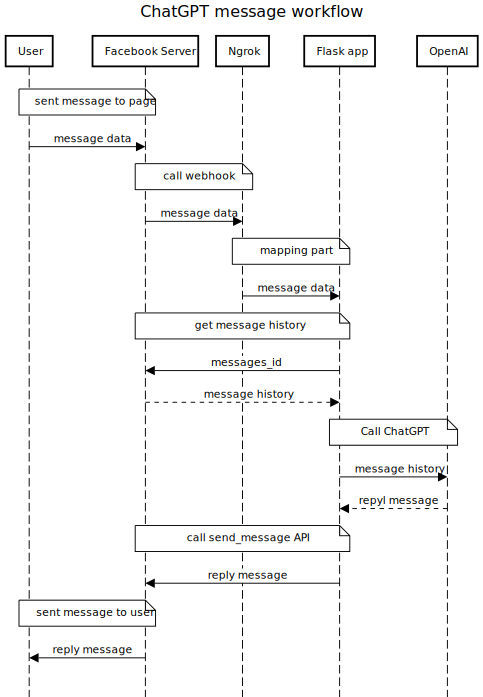

# Enhance Your Chatbot with Chat-GPT

This document will guide you through the process of integrating OpenAI's GPT-3 powered chatbot, ChatGPT, into a Facebook chatbot application written in Flask. This will greatly enhance the capabilities of your chatbot by allowing it to generate intelligent and contextually relevant replies to users' messages.

## Overview

To achieve this, we need to modify the flask application such that when a new message is received from a user, we:

1. Get the conversation history to feed to ChatGPT.
2. Generate a response message using ChatGPT based on the conversation history.
3. Send the generated response back to the user.

## Workflow Sequence Diagram

Below is a sequence diagram illustrating this workflow:



## Steps

### 1. Getting Conversation History

We need to get the chat history in order to generate a contextually relevant response. Below is the Python code for fetching conversation history:

```python
def get_history_message(sender):
    print("get_history_message running")
    url = f"{fb_api_url}{page_id}/conversations/?user_id={sender}&access_token={fb_page_access_token}&fields=messages"
    response = requests.request("GET", url, headers={}, data={})
    chat_history = []
    chat_ids = response.json()["data"][0]["messages"]["data"]
    for chat in chat_ids[:message_count]:
        messages_id = chat["id"]
        created_time = chat["created_time"]
        if is_old_message(created_time):
            break
        get_message_response = get_message(messages_id)
        message = get_message_response["message"]
        from_id = get_message_response["from"]["id"]
        chat_history.append({"message":message, "from_id":from_id})
    return chat_history

def get_message(messages_id):
    url = f"{fb_api_url}{messages_id}?access_token={fb_page_access_token}&fields=from,message"
    response = requests.request("GET", url, headers={}, data={})
    return response.json()
```

### 2. Generating Reply using ChatGPT

We will use OpenAI's `ChatCompletion.create()` method to generate a reply from our chatbot. Below is the Python code for creating the chatbot's reply:

```python
try:
    response = openai.ChatCompletion.create(
        model="gpt-3.5-turbo",
        messages=messages,
        temperature=0.2,
        top_p=0.2,
        max_tokens=512,
    )
    print(f"chatGPT response : {response}")

    response_message = response.choices[0].message.content
    finish_reason = response.choices[0].finish_reason

    if finish_reason == "length":
        response_message = response_message+"..."

except ex:
    logging.error(f"Unexpected error: {str(e)}")
    response_message = "please try again later"
```

### 3. Integrating into Existing Flask App

Finally, we need to modify the existing Flask application to incorporate the above changes.

In your existing Flask code, locate the function `listen()`. This is the function that Flask uses to listen to the `/webhook` endpoint. Here, we will modify the part where it sends a reply message:

Instead of using a hardcoded reply message:

```python
reply_message = f"reply for:{text}"
```

We should generate a reply using ChatGPT:

```python
# get the conversation history
chat_history = get_history_message(sender_id)

# generate a reply using ChatGPT
reply_message = generate_reply(chat_history)
```

Please ensure that the `generate_reply()` function integrates the ChatGPT code shown in

 step 2.

By following these steps, you will be able to leverage the power of OpenAI's GPT-3 to create intelligent and engaging responses in your chatbot application.